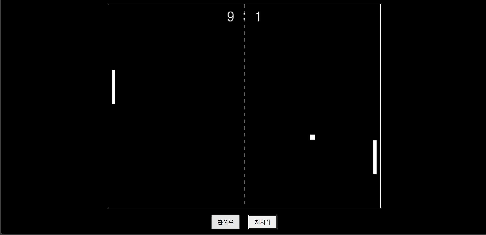

# 🕹️ JSPong - 클래식 HTML5 탁구 게임

> HTML, CSS, JavaScript만으로 만든 클래식 Pong 게임  
> 🎮 배포 주소: [js-pong.kro.kr](js-pong.kro.kr)

---

## 🚀 주요 기능

### 🎯 난이도 선택 가능
- 시작 화면에서 **Easy / Moderate / Hard** 선택 가능
- 난이도에 따라 AI의 반응 속도가 달라짐

### ⌨️ 키보드 조작
- **W**: 위로 이동  
- **S**: 아래로 이동  
- 마우스 조작은 제외됨

### 🟩 네모난 공과 클래식 룩
- 공이 네모로 디자인되어 클래식 감성 유지

### 📊 점수 시스템
- 점수는 상단에 실시간으로 표시
- 먼저 15점에 도달한 쪽이 승리

### 🧠 AI 패들
- 난이도에 따라 공을 더 빠르게 추적

### 🔁 게임 종료 후 기능
- "You Win" / "You Lose" 메시지를 **캔버스 위에 직접 표시**
- 하단에 **"홈으로", "재시작" 버튼** 제공
- 재시작 시 같은 난이도로 게임 재시작

### 🕒 딜레이 재시작
- 점수 후 약간의 대기 시간 후에 공이 다시 출발

### 📐 반사각 계산
- 패들의 어느 위치에 공이 맞았는지에 따라 공의 방향이 달라짐

---

## 🛠️ 기술 스택

| 항목       | 내용                  |
|------------|-----------------------|
| Frontend   | HTML, CSS, JavaScript |
| 배포       | Vercel + Custom Domain (`jspong.kro.kr`) |
| 상태 관리  | 전역 변수 + 상태 전환 (State Machine 방식) |
| UI 구성    | `<canvas>` 기반 2D 게임 렌더링 |

---

## 📁 프로젝트 구조

```
jspong/
├── index.html
├── style.css
├── pong.js
└── screenshots/
    ├── start.png
    ├── playing.png
    └── gameover.png
```

---

## 📸 예시 스크린샷

> 아래는 실제 플레이 화면입니다.  
> `./screenshots/` 폴더에 이미지 파일을 넣어주세요.

### ▶ 시작 화면


### ▶ 게임 중


### ▶ 게임 종료


---

## 🔧 실행 방법

1. 이 레포를 클론합니다:

```bash
git clone https://github.com/yourname/jspong.git
cd jspong
```

2. Python 등으로 간단한 로컬 서버 실행:

```bash
python3 -m http.server
```

3. 브라우저에서 [http://localhost:8000](http://localhost:8000) 접속

---

## ✅ 향후 개선 아이디어

- [ ] 양쪽 2인 플레이 모드 추가
- [ ] 사운드 효과 및 배경음
- [ ] 모바일 지원
- [ ] 승패 기록 저장 (localStorage)

---

## 🙌 만든 사람

이 프로젝트는 웹 프론트엔드 및 게임 로직 이해를 목적으로 제작되었습니다.  
피드백 환영합니다! ✉️

```
📛 이재현  
📧 jhleegit@gmail.com  
🌐 https://github.com/jhleegit
```

---

## 📄 라이선스

본 프로젝트는 MIT 라이선스를 따릅니다.
